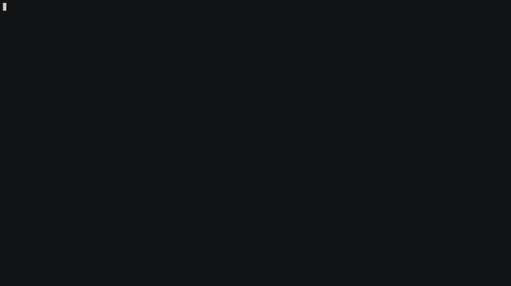

# armOS


    

     


Simple ARM Operating System for the Raspberry Pi, supporting Aarch32 and Aarch64 architectures. It supports both Raspberry Pi Zero / Zero W and Raspberry Pi 4.

This project was made for the Embedded Systems course at NTUA 2020-2021.

**Quick Links:**
- Wiki Documentation: https://github.com/thanoskoutr/armOS/wiki
- Doxygen Documentation: https://thanoskoutr.github.io/armOS/

## Table of Contents

- [armOS](#armos)
  - [Table of Contents](#table-of-contents)
  - [About](#about)
  - [Documentation](#documentation)
    - [Doxygen Documentation](#doxygen-documentation)
    - [Wiki Documentation](#wiki-documentation)
  - [Project Structure](#project-structure)
  - [Features](#features)
    - [Demo of kernel](#demo-of-kernel)
    - [Available Commands](#available-commands)
  - [Requirements](#requirements)
    - [Boards](#boards)
    - [Tools](#tools)
    - [Software](#software)
    - [Toolchain](#toolchain)
  - [Instructions](#instructions)
    - [Install Toolchain](#install-toolchain)
    - [Serial Connection with Raspberry PI](#serial-connection-with-raspberry-pi)
    - [Running on Raspberry Pi](#running-on-raspberry-pi)
    - [Generating Documentation](#generating-documentation)
    - [Implementation Details](#implementation-details)
  - [Technologies Used](#technologies-used)
  - [Resources](#resources)
    - [Manuals](#manuals)
    - [Wikis](#wikis)
    - [Repositories](#repositories)
    - [Book](#book)
  - [License](#license)

## About
This simple Operating System (kernel) is inspired and based on the Linux kernel, especially the ARM specific architecture parts. The features of the kernel are presented in detail in a later section. The main focus of this project, was to dive deep into core OS related concepts (such as the scheduler, drivers, handling processes/memory) and get to know the hardware and low level features of ARM embedded devices such as the Raspberry Pi.

The other focus of this project, was to explore both the `Aarch32` and `Aarch64` ARM states developing the OS using the ARMv6/ARMv7-a and the ARMv8-a architecture respectively. The 32-bit version is the older and more widespreed architecture in embedded devices, but the 64-bit version is a more powerfull, modern and secure architecture with lots of differences from the old one.

- The `Aarch32` version was tested on the Raspberry Pi Zero W, but it should work with minor changes to the Raspberry Pi 2 and the original Pi.
- Then `Aarch64` version was tested on the Raspberry Pi 4, but it should work with minor changes to the Raspberry Pi 3.

## Documentation
There is proper documentation available for the project in two different formats:

- In the [GitHub Pages](https://thanoskoutr.github.io/armOS/) of the project's GitHub repository.
- In the [Wiki section](https://github.com/thanoskoutr/armOS/wiki) of the project's GitHub repository.

### Doxygen Documentation
There is detailed documentation of all the source code, generated by [Doxygen](https://www.doxygen.nl), describing all the structures and functions of the project.

**NOTE:** The documentation is generated either for the Rasperry Pi 4 or the Raspberry Pi Zero / Zero W. They have some differences mainly regarding the register addresses, but they are mostly identical.

### Wiki Documentation
There are specific details about the implementation of most major parts of the OS, and guides for installing the dependencies and running the OS on a Pi.

## Project Structure
The project structure for the source code is the following:
```
├── arch
│   ├── armv6
│   ├── armv7-a
│   └── armv8-a
├── armstub
│   └── src
├── include
│   ├── armv6
│   ├── armv8-a
│   ├── common
│   ├── kernel
│   └── peripherals
└── src
    ├── common
    └── kernel
```
The `include/` directory contains definitions of structures and functions:

- `kernel/`: For the core features of the kernel.
- `armv6/` and `armv8-a/`: For architecture specific routines implemented in ARM assembly code.
- `common/`: For common libraries such as `string.h` and `stdlib.h` needed for the kernel.
- `peripherals/`: For the register's addresses for the peripherals of the devices, in order to provide basic drivers for them.

The `src/` directory contains the implementations of the functions defined in the `include/` directory.

The `arch/` directory contains the implementations of the architecture specific routines implemented in ARM assembly code, separated based on the ARM architecture.

The `armstub/` directory contains a simple bootloader for the ARMv-8 architecture, in order to boot the kernel in the proper [Exception Level](https://developer.arm.com/documentation/102412/0100/Privilege-and-Exception-levels).

## Features
The current features of the kernel are the following:

- Drivers for basic peripherals of the Pi boards:
    - [x] mini UART
    - [x] System Timers
    - [x] GPIO Pins
    - [x] LED
- Implementation of basic library functions:
    - [x] `string.h`
    - [x] `stdlib.h`
    - [x] `stdbool.h`
    - [x] `printk()`
- Exception Level handling for the ARMv-8 architecture:
    - [x] Setting kernel at EL 1.
- Handling Interrupts - Exceptions:
    - [x] Initialize vector table.
    - [x] Handles Timer and UART IRQs.
- Scheduler and processes:
    - [x] Creates and kills processes.
    - [x] Schedules them in order to run multiple processes concurrently.
    - [x] Performs Context Switching for the execution of different processes.
- Implementation of basic serial console:
    - [x] Communication with users through serial input and output.
    - [x] Available commands to execute.

Features to be implemented in the near feature:

- System Calls
- Proper Virtual memory management
- Video drivers

### Demo of kernel
A screenshot of the kernel in action, after booting up:

```
                  _____ _____
 ___ ___ _____   |     |   __|
| . |  _|     |  |  |  |__   |
|__,|_| |_|_|_|  |_____|_____|

armOS initializing...

        Board: Raspberry Pi 4
        Arch: aarch64


----- Exception level: EL1 -----
Initializing IRQs...Done
Enabling IRQ controllers...Done
Enabling IRQs...Done
Initializing LED...Done

This is a minimal console, type 'help' to see the available commands. (Maximum Input Length: 80)
root@pi-4#
```

A screencast where, we create 3 processes, run them and kill them:


### Available Commands
Showing the available commands of the console, using the `help` command:
```
root@pi-4# help
Available commands:
    help:
        Prints available commands to the console.
    help_led:
        Prints available LED commands to the console.
    create_procs:
        Creates proc_num kernel processes.
    run_procs:
        Runs the created kernel processes concurrently.
    kill_procs:
        Kills all created kernel processes.
    halt:
        Halts the system.
```


## Requirements
In order to run this kernel in a Raspberry Pi you need the following:

### Boards
A Rasberry Pi board. One of the following:

- Raspberry Pi 4
- Raspberry Pi Zero or Zero W

### Tools
- A USB to TTL serial cable.
- An a SD Card.

### Software
- The [Pi Imager](https://www.raspberrypi.org/software/) program.
- A Linux/Unix development environment to build the project.
- A Serial Console emulator (suggested: `screen`).

### Toolchain
An ARM Cross-Compiler Toolchain:
- For building the 32-bit kernel: `arm-none-eabi-gcc`: [Download from ARM website - For Linux x86_64 Hosts](https://developer.arm.com/tools-and-software/open-source-software/developer-tools/gnu-toolchain/gnu-rm/downloads)
- For building the 64-bit kernel: `aarch64-none-elf-gcc` [Download from ARM website - For Linux x86_64 Hosts](https://developer.arm.com/tools-and-software/open-source-software/developer-tools/gnu-toolchain/gnu-a/downloads)


## Instructions

### Install Toolchain
For detailed instructions, see the [Install Toolchain](https://github.com/thanoskoutr/armOS/wiki/Install-Toolchain) wiki page.

### Serial Connection with Raspberry PI
For detailed instructions, see the [Serial Connection](https://github.com/thanoskoutr/armOS/wiki/Serial-Connection) wiki page.


### Running on Raspberry Pi
For detailed instructions, see the [Installation](https://github.com/thanoskoutr/armOS/wiki/Installation) wiki page.

Basic overview of the steps:

- Format the SD card, with the Raspberry Pi Imager.
- Set cross-compiler path on the Makefile.
- Clone the project.
- Build project using `Makefile`.
- Transfer `.img`, `config.txt` to SD Card.
- Unmount SD card.
- Put SD card on Pi.
- Connect USB-to-TTL serial cable to the Pi and Linux host.
- Open `screen`.
- Power on the Pi.

### Generating Documentation
In order to generate the Doxygen documentation locally, see the [Generate Docs](https://github.com/thanoskoutr/armOS/wiki/Generate-Docs) wiki page.

### Implementation Details
For information about the source code, see on [Wiki](https://github.com/thanoskoutr/armOS/wiki), the *Implementation* section.

For detailed documentation of all the source code, generated by Doxygen, describing all the structures and functions of the project, see the [GitHub Pages](https://thanoskoutr.github.io/armOS/) hosted site.

## Technologies Used
A complete list of all the technologies used in this project:

| Technology       | Selection                                   |
| ---------------- | ------------------------------------------- |
| Editor           | `Visual Studio Code`                        |
| Host OS          | `Ubuntu 20.04`                              |
| Cross-Compiler   | `arm-none-eabi-gcc`, `aarch64-none-elf-gcc` |
| Binutils         | `objdump`, `objcopy`, `size`, `nm`          |
| Building         | `Make`                                      |
| Scripts          | `Bash`                                      |
| Documentation    | `Doxygen`                                   |
| CI               | `Travis CI`                                 |
| Static Hosting   | `GitHub Pages`                              |
| Version Control  | `Git`, `GitHub`                             |
| Console Emulator | `screen`                                    |
| Boards           | Raspberry Pi 4, Raspberry Pi Zero W         |
| Hardware         | SD card, USB-to-TTL Serial cable            |

## Resources

### Manuals

- [BROADCOM BCM2835](https://www.raspberrypi.org/documentation/hardware/raspberrypi/bcm2835/README.md)
- [BROADCOM BCM2711](https://www.raspberrypi.org/documentation/hardware/raspberrypi/bcm2711/README.md)
- [AArch64 memory management](https://developer.arm.com/documentation/101811/latest)

### Wikis

- [OSDev.org - Raspberry Pi Bare Bones](https://wiki.osdev.org/ARM_RaspberryPi_Tutorial_C)
- [ARM Developer](https://developer.arm.com/)

### Repositories

- [Linux Kernel - /arch/arm/](https://github.com/torvalds/linux/tree/master/arch/arm)
- [Learning operating system development using Linux kernel and Raspberry Pi](https://github.com/s-matyukevich/raspberry-pi-os)
- [Building an Operating System for the Raspberry Pi](https://jsandler18.github.io/)
- [Raspberry Pi ARM based bare metal examples](https://github.com/dwelch67/raspberrypi)
- [Bare metal Raspberry Pi 3 tutorials](https://github.com/bztsrc/raspi3-tutorial)
- [Writing a "bare metal" operating system for Raspberry Pi 4](https://github.com/isometimes/rpi4-osdev)

### Book

- [The little book about OS development](http://littleosbook.github.io/)

## License
This project is licensed under the MIT license. See [LICENSE](LICENSE.md) for details.