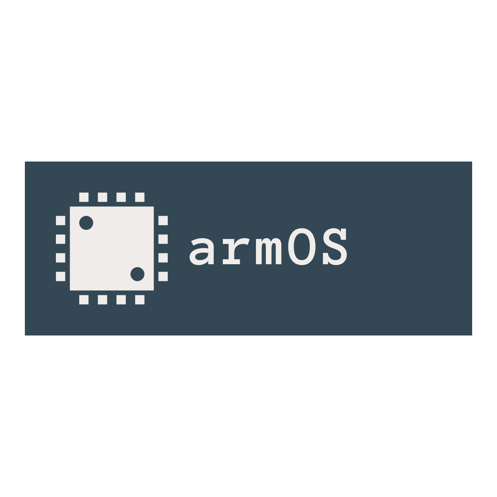

<!--  -->
<!--  -->


<!--  -->

# Custom ARM OS from scratch

Embedded Systems NTUA 2020 - Bonus Project

[minimARM-OS](https://github.com/thanoskoutr/minimARM-OS)

 [thanoskoutr](https://github.com/thanoskoutr)


 

---

### Rasbperry Pi - CPU Differences

| Specs / Pi Vers. | Pi Zero - Pi Zero W | Pi 2         | Pi 3              | Pi 4              |
| :--------------: | ------------------: |------------: |-----------------: |-----------------: |
| Broadcom Chip    | BCM2835             | BCM2836      | BCM2837           | BCM2711           |
| ARM Core         | ARM1176JZF-S        | Cortex-A7    | Cortex A53        | Cortex A72        |
| ARM Core Family  | ARM11               | Cortex-A     | Cortex-A          | Cortex-A          |
---

| Specs / Pi Vers. | Pi Zero - Pi Zero W | Pi 2         | Pi 3              | Pi 4              |
| :--------------: | ------------------: |------------: |-----------------: |-----------------: |
| ARM Architecture | ARMv6               | ARMv7-A      | ARMv8-A           | ARMv8-A           |
| Cores            | Single core         | Quad Core    | Quad Core         | Quad Core         |
| ISA Support Arch | -                   | AArch32      | AArch32 & AArch64 | AArch32 & AArch64 |
| Instruction Set  | 32 + 16 bit         | 32 + 16 bit  | 64 + 32 bit       | 64 + 32 bit       |

---

| Specs / Pi Vers. | Pi Zero - Pi Zero W | Pi 2         | Pi 3              | Pi 4              |
| :--------------: | ------------------: |------------: |-----------------: |-----------------: |
| Thumb Support    | Thumb2 (T32)        | Thumb2 (T32) | -                 | -                 |
| FPU              | VFPv2               | VFPv4        | VFPv4             |  VFPv4            |
| NEON (SIMD)      | -                   | 64-bit wide  | 128-bit wide      | 128-bit wide      |


---

### `uart.c`
In order to enable interrupts for the mini UART, we first have to enable interrupts from the `uart_init()` function:
```c
mmio_write(AUX_MU_IER_REG, (1 << 0) | (1 << 2) | (1 << 3));
/*
 * Bit 0: Enable receive interrupt
 * Bit 1: Enable transmit interrupt
 * Bit 2&3: Required in order to receive interrupts
 */
```

---

The broadcom datasheets are wrong about the `IER` register bit values as:

- Bits `3:2` are marked as don't care, but are actually required in order to receive interrupts.

- Bits `1:0` are swaped. `bit 0` is receive interrupt and `bit 1` is transmit.

So in order to enable interrupts it seems we need to write the value `0xd` = `0b1101`.

---

Then we have the interrupt handler for the mini UART interrupts:
```c
void handle_uart_irq()
{
	unsigned char c;

	/* While the receiver holds a valid bit (on Read) */
	while ((mmio_read(AUX_MU_IIR_REG) & (1 << 2)) == (1 << 2)) {
		c = uart_getc();
		if (c == '\r') {
			/* When user presses Enter a CR is returned */
			uart_putc(c);
			uart_putc('\n');
		}
		else {
			uart_putc(c);
		}
	}
```

---

The basic code here is that we read bits `2:1` of the `IIR` register and there are 4 possible states:

- `00` : No interrupts
- `01` : Transmit holding register empty
- `10` : Receiver holds valid byte
- `11` : Not possible

We loop while the receiver holds valid byte, meaning we have data available, and we just read them with `uart_getc()` and display them in the serial monitor with `uart_putc(c)`.

---

**NOTE:**

Because, when the user presses Enter in the serial monitor it returns a carriage return (`CR`) character to the device, so if we write just this character back on the serial output, we won't have a new line. So we check if a `CR` character has been transmitted, we also output an `NL` (newline) character.